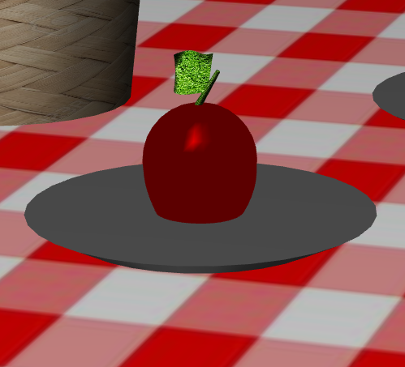
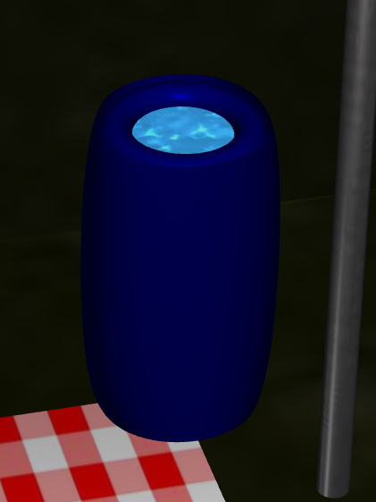

# LAIG 2020/2021 - TP2

## Group T06G02

| Name                       | Number    | E-Mail              |
| ---------------------------| --------- | --------------------|
| Clara Alves Martins        | 201806528 | up201806528@fe.up.pt|
| Beatriz Costa Silva Mendes | 201806551 | up201806551@fe.up.pt|

----
## Project information

- Scene Strong Points
  - Added a barrel of water and an apple to the picnic  
  - Welcome sign 
  - Tree leaves wave with the wind  
  - Fire burns while moving  
- Scene
  - The scene consists of a camp in a forest, in which tents, logs, and a bonfire are present. There is also a log and a tire serving as seats near the fire and a picnic with an apple and water. 
  - [Link to the Scene](https://git.fe.up.pt/laig/laig-2020-2021/t06/laig-t06-g02/-/blob/master/TP1/scenes/LAIG_TP1_XML_T6G02.xml))
----
## Issues/Problems

- (items describing unimplemented features, bugs, problems, etc.)
